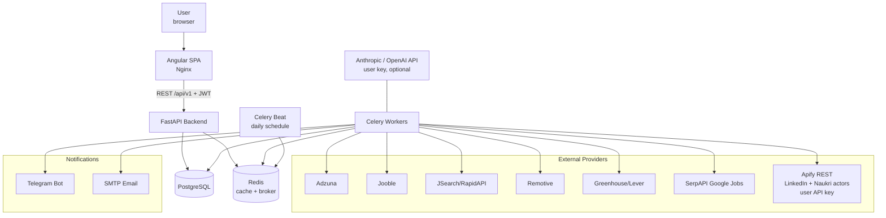
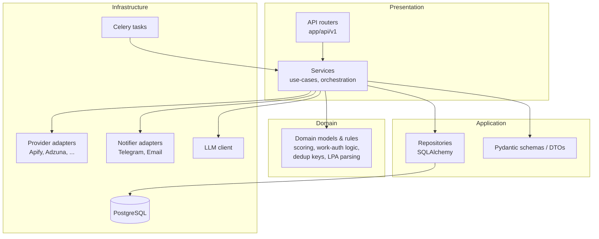
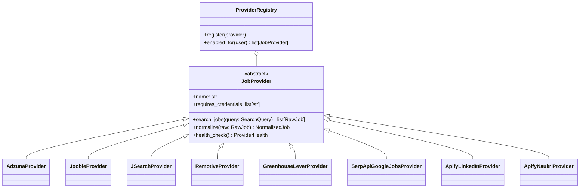
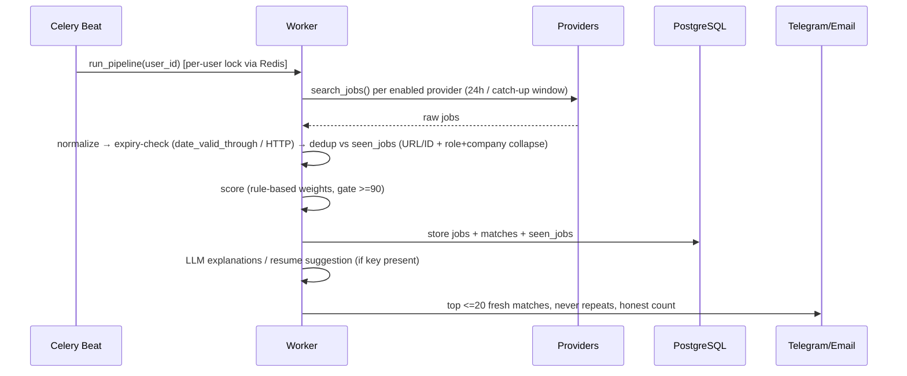

# AJH Architecture

## 1. System context



## 2. Clean-architecture layers (backend)



Dependency rule: Presentation → Application → Domain. Infrastructure implements
interfaces defined in Application/Domain. No business logic in routers or Angular
components. Repositories are the only layer touching SQLAlchemy sessions.

## 3. Provider plugin design



A provider is enabled for a user only when its required credentials exist in that
user's encrypted credential store. Apify providers activate when the user saves an
Apify API key. Failure policy (CLAUDE.md §5): timeout → retry once → mark unhealthy →
continue with remaining providers.

## 4. Scheduler pipeline (Celery)



## 5. Repository layout

```text
ajh/
  backend/
    app/
      api/v1/        # routers only (Presentation)
      core/          # settings, security, logging
      services/      # use-cases (Application)
      schemas/       # Pydantic DTOs
      models/        # SQLAlchemy ORM models
      repositories/  # DB access (Infrastructure)
      providers/     # job-provider adapters
      matching/      # scoring engine + LLM client
      scheduler/     # celery app, tasks, locks
      notifications/ # telegram + email adapters
      auth/ users/ profiles/ jobs/ resumes/ applications/ analytics/ admin/
      database/      # session, base, alembic env
      tests/
    pyproject.toml   # pinned deps (see file)
  frontend/          # Angular workspace (initialized in Phase 9; version pinned then)
  infra/nginx/
  .github/workflows/
  docs/
```

## 6. Version pins (backend, verified 2026-07-10)

FastAPI 0.139.0 · SQLAlchemy 2.0.51 · Alembic 1.18.5 · Celery 5.6.3 · Pydantic 2.13.4 ·
pydantic-settings 2.14.2 · uvicorn 0.51.0 · redis-py 8.0.1 · asyncpg 0.30.0 · httpx 0.28.1 ·
PyJWT 2.10.1. Target Python 3.12+ (Docker image `python:3.12-slim`).
Angular version pinned at Phase 9 start per CLAUDE.md §2.

## 7. Key decisions in this phase

- **App-factory pattern** (`create_app()`) → clean test isolation, no import-time side effects.
- **Settings via pydantic-settings** with `lru_cache` — env-driven, no candidate-specific values.
- **Per-user provider credentials encrypted** (Fernet key in env) rather than global env keys —
  each user brings their own Apify/LLM/SerpAPI keys.
- **Celery Beat + Redis-lock per user** prevents overlapping runs (CLAUDE.md §14).
- **Scoring is Domain-layer pure code** — deterministic and unit-testable; LLM is an
  Infrastructure adapter used after gating, never for the score itself (integrity rule §7).
