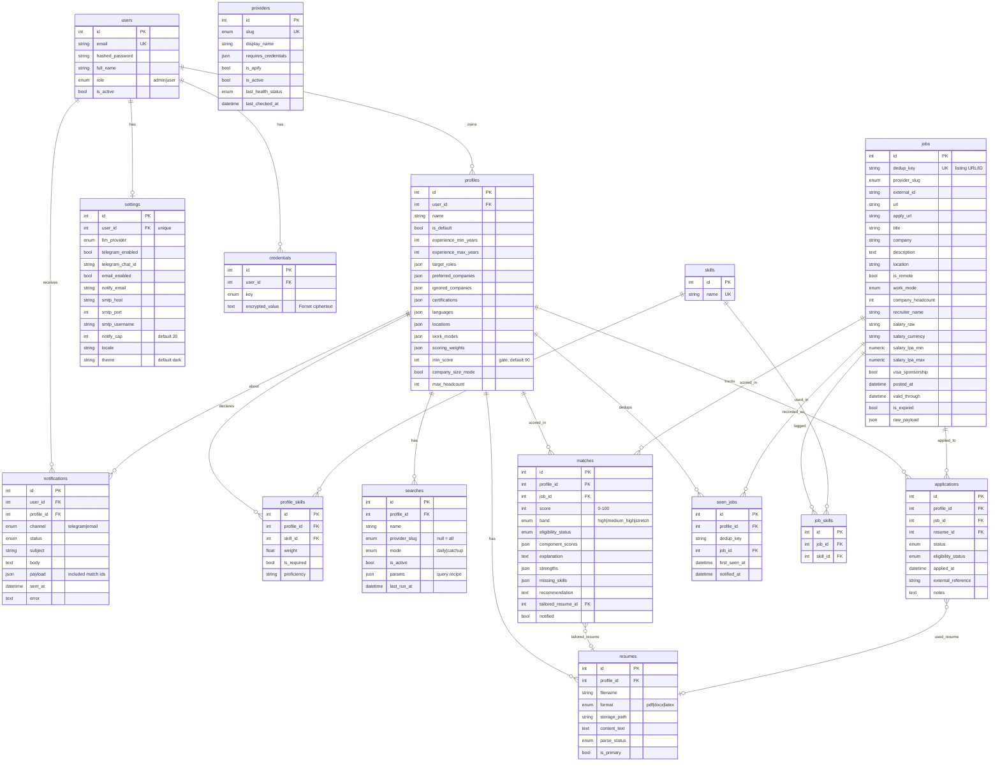

# AJH Database (Phase 2)

PostgreSQL + SQLAlchemy 2.0 (async) + Alembic. Schema covers every table in
CLAUDE.md §15 plus a `matches` table for scored results (needed by the pipeline in
§14). Enum columns are stored as `VARCHAR + CHECK` with lowercase values; JSON
columns hold list/dict config that §15 does not call out as its own table.

## ER diagram

## Table notes

| Table | Purpose | Spec |
|---|---|---|
| `users` | Accounts + RBAC (admin/user) | §12 |
| `profiles` | All candidate-specific config; skills normalized, the rest in JSON | §4 |
| `skills` / `profile_skills` | Canonical skill vocabulary; the join carries scoring weight | §4, §7 |
| `resumes` | PDF/DOCX/LaTeX uploads, parse status, per-profile | §11 |
| `jobs` | Global normalized listing catalog, unique on `dedup_key` | §5, §6 |
| `job_skills` | Skills extracted from a posting (shared `skills` vocab) | §15 |
| `matches` | Scored (profile, job) result: score, band, breakdown, LLM enrichment | §7 |
| `seen_jobs` | Per-profile dedup store — every listing ever shown, keyed on URL/ID | §6 |
| `providers` | Provider catalog + best-effort health | §5 |
| `credentials` | Per-user encrypted API keys (Fernet), one row per (user, key) | §15 |
| `settings` | Per-user notification/LLM/UI preferences (secrets stay in `credentials`) | §13 |
| `searches` | Saved search templates / query recipes (opaque `params` JSON) | §4, §5 |
| `applications` | Application lifecycle tracking, carries eligibility | §8 |
| `notifications` | Delivery log (Telegram/Email), records bundled match ids | §7, §13 |

## Design decisions

- **Enums as `VARCHAR + CHECK`** (`native_enum=False`, `values_callable`) — portable
  (Postgres + SQLite), migration-friendly (no native-type ALTER dance), stores
  readable lowercase values that match Pydantic serialization.
- **JSON for list-like profile config** — CLAUDE.md §15 names only `skills` as a
  normalized child; target roles, companies, locations, weights, etc. live in JSON
  columns on `profiles`, avoiding a dozen thin join tables.
- **`jobs` global vs `seen_jobs`/`matches` per-profile** — the catalog is deduped
  once on `dedup_key`; "already shown" and "scored" state is per-profile.
- **Secrets isolated in `credentials`** — encrypted at rest; `settings` and
  `providers` hold only non-secret config.
- **Lazy engine/session** — building the engine is deferred to first use so importing
  models needs no DB driver (keeps model tests driver-free).
- **Deterministic constraint names** via a metadata naming convention → stable,
  reviewable Alembic autogenerate output.

## Migrations

See `backend/alembic/README.md`. Apply to a fresh Postgres with `alembic upgrade
head`. The initial migration (`initial schema`) creates all 15 tables and was
verified with a full upgrade→downgrade round-trip.
