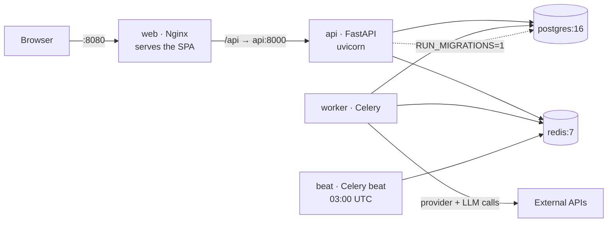

# Deployment

Six containers. The API, Celery worker, and Celery beat all run from the **same** backend
image with different commands — so they can never drift out of sync with each other.



| Service | Image | Command | Port |
|---|---|---|---|
| `postgres` | `postgres:16-alpine` | — | internal |
| `redis` | `redis:7-alpine` | `--appendonly yes` | internal |
| `api` | `./backend` | `uvicorn app.main:app` | `8000` |
| `worker` | `./backend` | `celery … worker` | — |
| `beat` | `./backend` | `celery … beat` | — |
| `web` | `frontend/Dockerfile` | Nginx | `8080` |

## Run it

```bash
cp .env.example .env      # then fill in the two secrets — see the README
docker compose up -d --build
docker compose ps         # everything should reach healthy
docker compose logs -f api
```

Stop / reset:

```bash
docker compose down          # stop, keep data
docker compose down -v       # ALSO delete the database and uploaded résumés
```

## Design decisions worth knowing

**Only the API migrates.** `RUN_MIGRATIONS=1` is set on the `api` service and nowhere else.
The worker and beat boot from the same image but must not race each other applying the same
Alembic revision. `worker` and `beat` therefore `depends_on: api → service_healthy`, which
means they only start once migrations have actually been applied.

**Missing secrets fail loudly.** `SECRET_KEY` and `CREDENTIALS_ENCRYPTION_KEY` use compose's
`${VAR:?message}` form, so a missing value stops the stack with a readable error instead of
silently booting with an insecure default.

**No CORS layer anywhere.** The frontend calls the relative path `/api/v1`. Nginx proxies it
to `api:8000`, so the browser only ever talks to one origin. In development, `ng serve` does
the same thing via `proxy.conf.json`. This is why the FastAPI app has no CORS middleware —
it doesn't need any.

**`index.html` is never cached; hashed assets are cached forever.** Otherwise a deploy leaves
users pinned to a stale bundle.

**Nginx `proxy_read_timeout` is 300s.** A manual pipeline run blocks on provider calls, and
Apify actor runs in particular are slow. The default 60s would cut them off.

**Volumes.** `pgdata` (database), `redisdata` (broker/results), `resumes` (uploaded files,
mounted into both `api` and `worker`).

## Configuration

Everything is env-driven. Set in `.env`:

| Variable | Notes |
|---|---|
| `SECRET_KEY` | Signs JWTs. Changing it invalidates every existing login. |
| `CREDENTIALS_ENCRYPTION_KEY` | Fernet key. **Changing it makes stored API keys unreadable.** |
| `POSTGRES_USER` / `POSTGRES_PASSWORD` / `POSTGRES_DB` | Database credentials. |

Provider and LLM keys are **not** environment variables. Each user stores their own through
the Settings screen; they're encrypted into the database with `CREDENTIALS_ENCRYPTION_KEY`.

## Backups

The database holds everything that matters — including your encrypted API keys.

```bash
docker compose exec postgres pg_dump -U ajh ajh > backup.sql
```

A backup is only restorable with the **same** `CREDENTIALS_ENCRYPTION_KEY`. Back that key up
separately, or the restored keys are just noise.

## CI

`.github/workflows/ci.yml` runs on every push and PR:

1. **backend** — ruff, isort, black, `pytest` (85 tests, in-memory SQLite, no service
   containers needed), then `alembic upgrade head && alembic check` to catch a model that was
   edited without a matching migration.
2. **frontend** — `npm ci && npm run build`.
3. **images** — builds both Docker images. This is the authoritative check that the image
   definitions are sound.

## Verification status (be aware)

The compose file is schema- and interpolation-validated (`docker compose config` passes). The
**images have not been built on the development machine** — the local Docker daemon was not
responding, so `docker build` could not run there. The CI `images` job builds both, and
`docker compose up -d --build` on your machine is the real first run.

If the backend image fails to build, the most likely cause is a wheel that isn't available for
`linux/amd64` on Python 3.12 (local development ran on 3.13). Everything pinned in
`pyproject.toml` ships manylinux wheels for cp312 today.

## Troubleshooting

| Symptom | Cause |
|---|---|
| Stack won't start, complains about `SECRET_KEY` | `.env` missing or the value is blank. |
| `api` unhealthy, logs show a Postgres connection error | Postgres wasn't healthy yet — compose waits for it, so this usually means bad credentials. |
| Login works, then every request 401s | `SECRET_KEY` changed between restarts. |
| Stored API keys all read as `****` and providers fail | `CREDENTIALS_ENCRYPTION_KEY` changed. Re-enter the keys. |
| Refresh on `/matches` 404s | Nginx isn't falling back to `index.html` — check `infra/nginx/default.conf`. |
| Nothing gets notified, but matches exist | Expected if no channel is enabled *and* its secret stored. Both are required. |
| A run reports 0 qualified | Also expected. The gate is ≥90 and scores are never inflated. |
